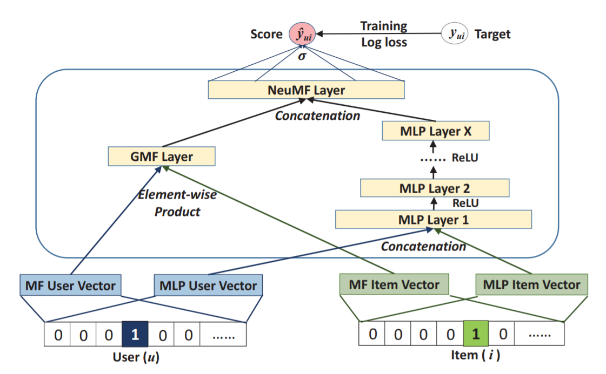

## Neural Collaborative Filtering, NeuMF

NeuMF is a combination of matrix factorization and multilayer perceptron. The multilayer perceptron takes the concatenation of user and item embeddings as the input.

In this repository you'll find the tensorflow-recommender implementation for NeuMF. To test the architecture for your own case:

- create your own embedding models for item and user.
- in main.py, change the initialization of the embedddings for both MF and MLP.
